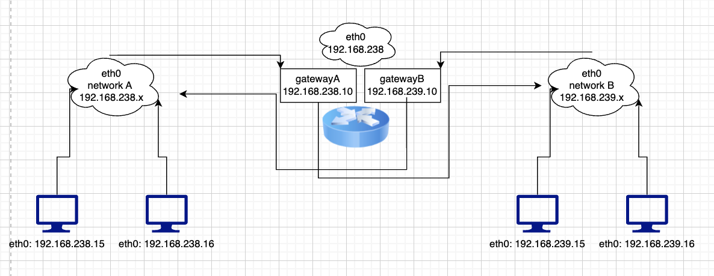

### config the linux server network like this 

#### Q1
```
We have four app server from app01 to app04. You can access each app from jump host using command ssh app01 and similarly for other apps. Assign new IPs to each host as per details given below:


a. Assign 172.16.238.15/24 ip address to app01

b. Assign 172.16.238.16/24 ip address to app02

c. Assign 172.16.239.15/24 ip address to app03

d. Assign 172.16.239.16/24 ip address to app04

e. We also need to remove existing IPs from these apps after assigning them new IPs but do not remove them right now as it can break your connection, if you are sure you are done with required changes just click on Check button below, it will do the rest.

Warning: If changes aren't made correctly it can break your connection to the environment and you may need to reload the lab.
172.16.238.15
```

#### Q2
```
Since now app03 and app04 are on different network range than jump host so you are not able to SSH into those hosts from jump host. To make SSH work make required changes on jump host.


a. Assign a new IP address 172.16.239.10/24 to jump host with same network range which app03 and app04 are using.

b. Now you will be able to SSH into all apps from jump host.

NOTE: - After the change, you may experience a delay when trying to SSH from the jump server to the app servers.
172.16.239.10
```

#### Q3
```
Now jump host is able to access all four apps. But if you try to ping app03 or app04 from app01 or app02 or vice versa you will see ping is not working. So now we want to use jump host as a router so that app01 and app02 can access app03 and app04 and vice versa, lets add some routing table entries on these hosts to make it work.


a. Add a routing table entry in app01 and app02 hosts so that these hosts can reach app03 and app04 hosts via jump host.

b. Add a routing table entry in app03 and app04 hosts so that these hosts can reach app01 and app02 hosts via jump host.

c. Now try to ping app03 and app04 from app01 and app02 and vice versa, every app should be able to ping each other.
```

### answer using>> ip addr add <ip> 
```
thor@jumphost ~$ ip addr
1: lo: <LOOPBACK,UP,LOWER_UP> mtu 65536 qdisc noqueue state UNKNOWN group default qlen 1000
    link/loopback 00:00:00:00:00:00 brd 00:00:00:00:00:00
    inet 127.0.0.1/8 scope host lo
       valid_lft forever preferred_lft forever
15: eth0@if16: <BROADCAST,MULTICAST,UP,LOWER_UP> mtu 1500 qdisc noqueue state UP group default 
    link/ether 02:42:ac:10:ee:0a brd ff:ff:ff:ff:ff:ff link-netnsid 0
    inet 172.16.238.10/24 brd 172.16.238.255 scope global eth0
       valid_lft forever preferred_lft forever
    inet 172.16.239.10/24 scope global eth0
       valid_lft forever preferred_lft forever
23: eth1@if24: <BROADCAST,MULTICAST,UP,LOWER_UP> mtu 1410 qdisc noqueue state UP group default 
    link/ether 02:42:ac:11:00:05 brd ff:ff:ff:ff:ff:ff link-netnsid 0
    inet 172.17.0.5/16 brd 172.17.255.255 scope global eth1
       valid_lft forever preferred_lft forever
thor@jumphost ~$ ip route
default via 172.16.238.1 dev eth0 
172.16.238.0/24 dev eth0 proto kernel scope link src 172.16.238.10 
172.16.239.0/24 dev eth0 proto kernel scope link src 172.16.239.10 
172.17.0.0/16 dev eth1 proto kernel scope link src 172.17.0.5 
thor@jumphost ~$
```

```
for Q2/Q3: then ip route <destination network-ip> via <gateway> on each of the machine
```

