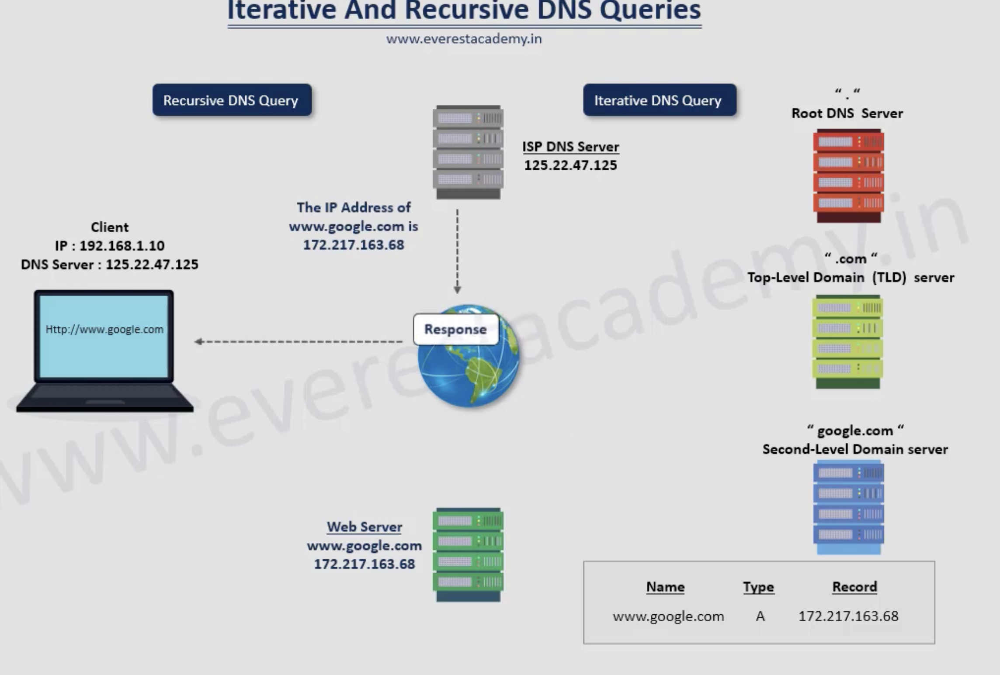
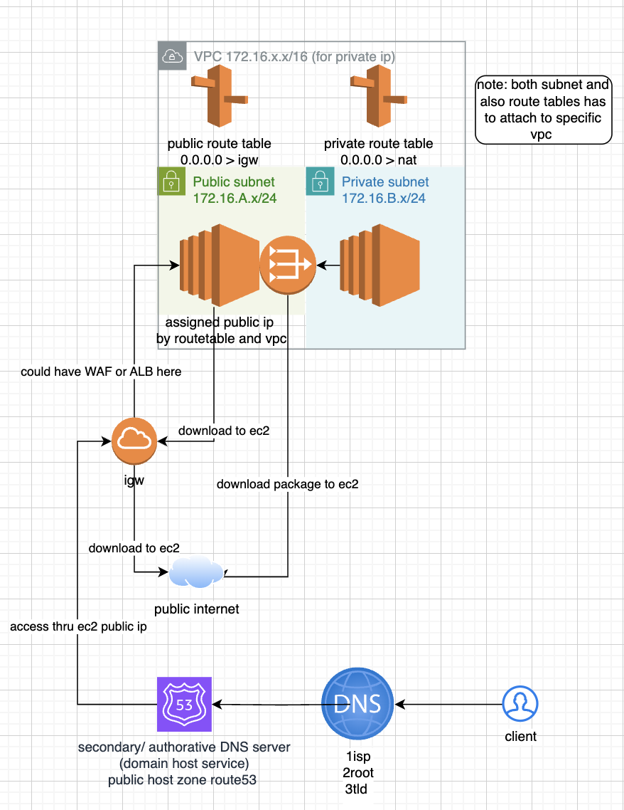

### dns in general

https://www.recordedfuture.com/threat-intelligence-101/cyber-threat-landscape/dns-root-servers

## /etc/hosts (direct public ip by-passing/ no dns server) vs /etc/resolv/conf (for caching the authorative dns server by-passing isp query)

#### 192.168.1.100   isp dns server
#### 192.168.x.x , 172.16.x.x private ip
#### 203.0.113.0/24 public ip depends on public ip pool (isp/cloud provider managed)

### explication of aws traffic 1 public subnet

### explication of aws traffic 2 only private subnet 

